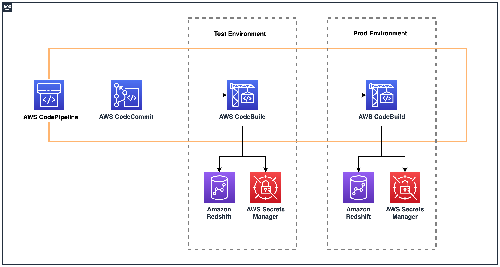
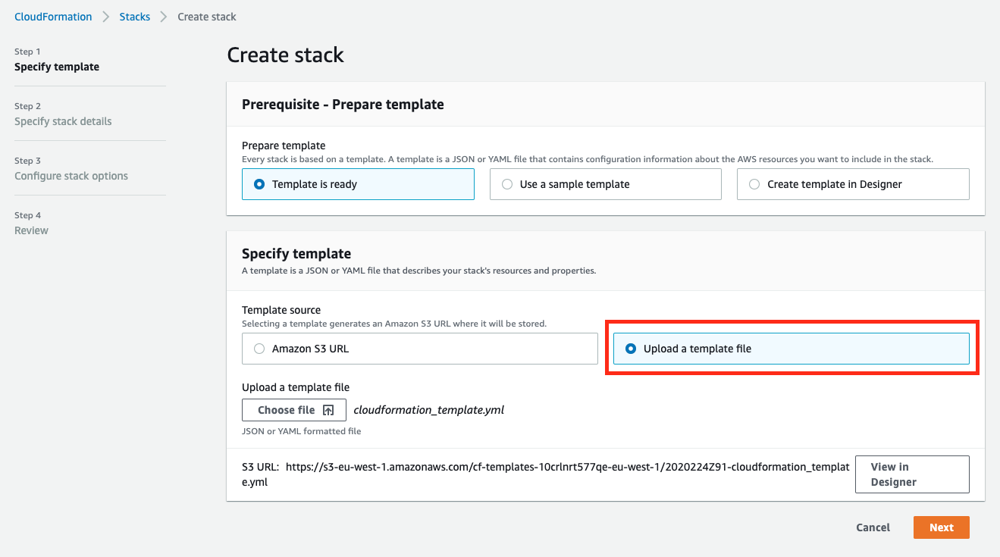
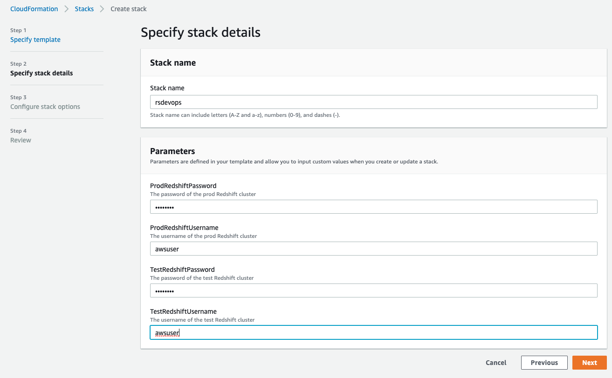
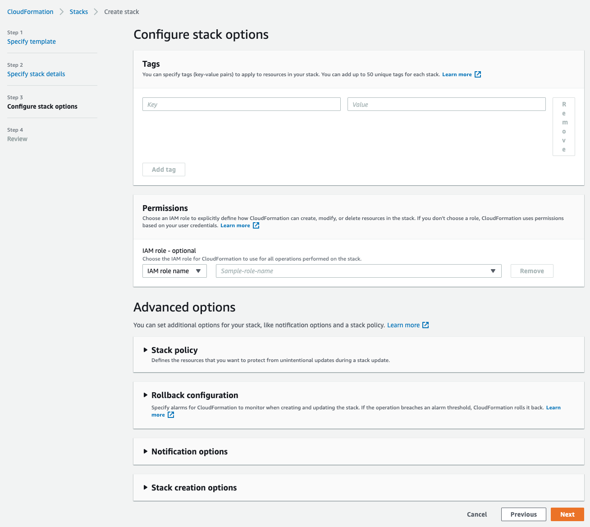
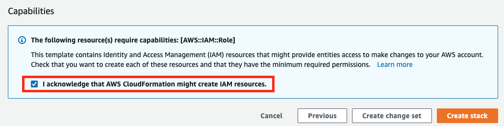
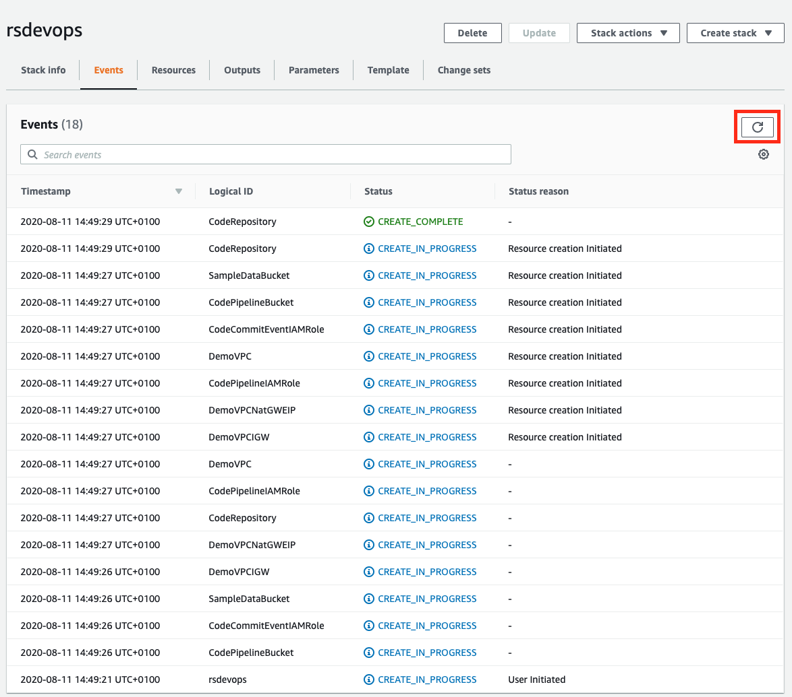
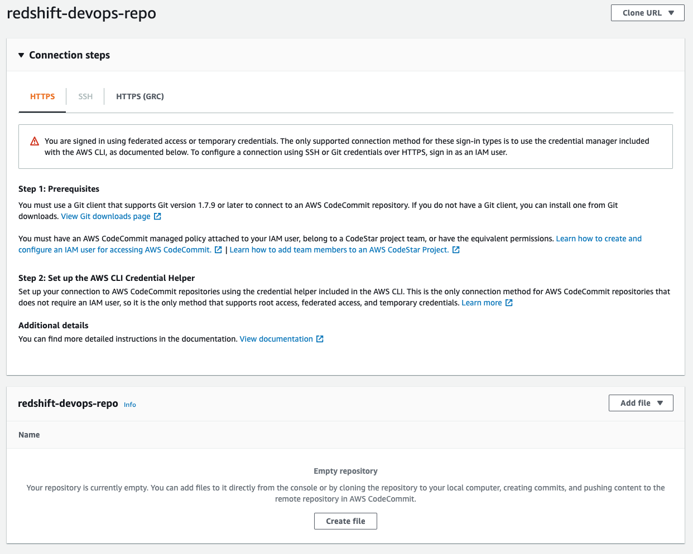
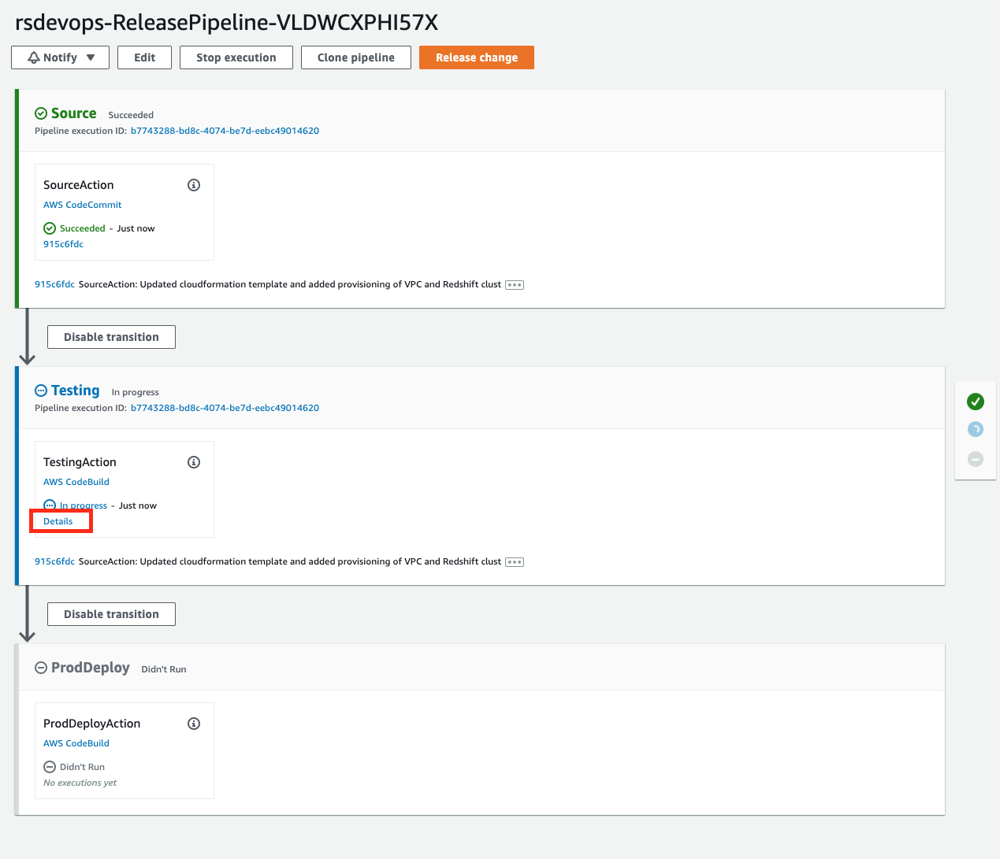
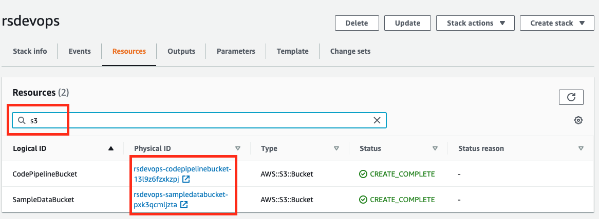

# Amazon Redshift Devops

This repository contains sample code for the AWS Blog Post `Applying CI/CD DevOps Principles to Amazon Redshift Development`.

## High Level Architecture


## Components
This demo uses the following components to enable CI/CD of Redshift Stored Procedures and schema changes.
- AWS CodePipeline to do the overall orchestration.
- AWS CodeCommit as the version control system. 
- AWS CodeBuild as the execution environment for Apache Maven.
- AWS Secrets Manager to store the Redshift connection parameters.

The application uses [Apache Maven](https://maven.apache.org/) with [Flyway](http://flywaydb.org/) for database migrations and [JUnit](http://junit.org/) for unit testing.

The demo also provides 2 types of buildspec file:
- buildspec_test.yml for the testing phase
- buildspec_prod.yml for the deployment phase

## Deploying the Example App

### Clone the GitHub Repository
The AWS CloudFormation template and the source code for the example application can be found here: https://github.com/aws-samples/amazon-redshift-devops-blog. Before you get started, you need to clone the repository using the following command:

`git clone https://github.com/aws-samples/amazon-redshift-devops-blog`

This will create a new folder, `amazon-redshift-devops-blog`, with the files inside. 

### Deploy CloudFormation Template
Go to the CloudFormation console and click “Create Stack” then choose “With new resources (standard)”. 

Once you’re in the “Create stack” page, choose “Upload a template file” and then “Choose file”. The file should be in `<cloned_directory>/cloudformation_template.yml`. After you select the file, your screen should look like the following:



Click “Next” and complete the parameters. 



Click "Next"



We can leave everything as is in this page and click “Next”.



Lastly, scroll to the bottom of the page and check the acknowledgement and click “Create stack”. The stack will create the VPC, Redshift clusters, CodeCommit repository, CodeBuild projects for both test and prod, and lastly the pipeline using CodePipeline to orchestrate the change release process. 



Click the refresh button on the top right corner to track the progress of the stack creation.

### Push Code to the CodeCommit Repository
Once the stack creation has completed, go to the CodeCommit console and you’ll find the redshift-devops-repo repository that CloudFormation created. Clicking on the repo name will take you to the following screen:



Before you can push any code into this repo, follow the steps outlined in the [CodeCommit documentation](https://docs.aws.amazon.com/codecommit/latest/userguide/setting-up-gc.html#setting-up-gc-connect-console). Once you reached Step 4, copy the HTTPS URL, and instead of cloning, we would be adding the CodeCommit repo URL into the code that we cloned earlier by doing the following steps:

```
git remote add codecommit <repo_https_url> 
git push codecommit main
```

The last step will populate the repository and you can confirm it by refreshing the CodeCommit console. If you get prompted for username and password, input the Git credentials that you generated and downloaded from Step 3.

### CI/CD Pipeline
Once you pushed the code into the CodeCommit repository in the previous step, this will trigger the CodePipeline to deploy the code into both the test and prod Redshift clusters. You can monitor the progress using the CodePipeline console. Your screen should look something like this:



You can dive deeper into the progress of the “build” by clicking on the details link as indicated in the screenshot above. This will take you to CodeBuild where you can see the execution logs as well as the result of the testing via Test Reports.

### Clean Up
After you’re done, it’s crucial to tear down the environment to avoid incurring additional charges beyond your testing. Before you delete the CloudFormation stack. Go to the “Resources” tab of your stack and make sure the 2 S3 buckets that were provisioned are empty. If they’re not empty, it’s safe to delete all the contents of the bucket. Example:



You can search for “s3” and click the associated links to go to the bucket directly. Once the buckets are empty. Click the delete button to tear down the stack and delete all the provisioned resources.

## Security

See [CONTRIBUTING](CONTRIBUTING.md#security-issue-notifications) for more information.

## License

This library is licensed under the MIT-0 License. See the [LICENSE](LICENSE) file.

